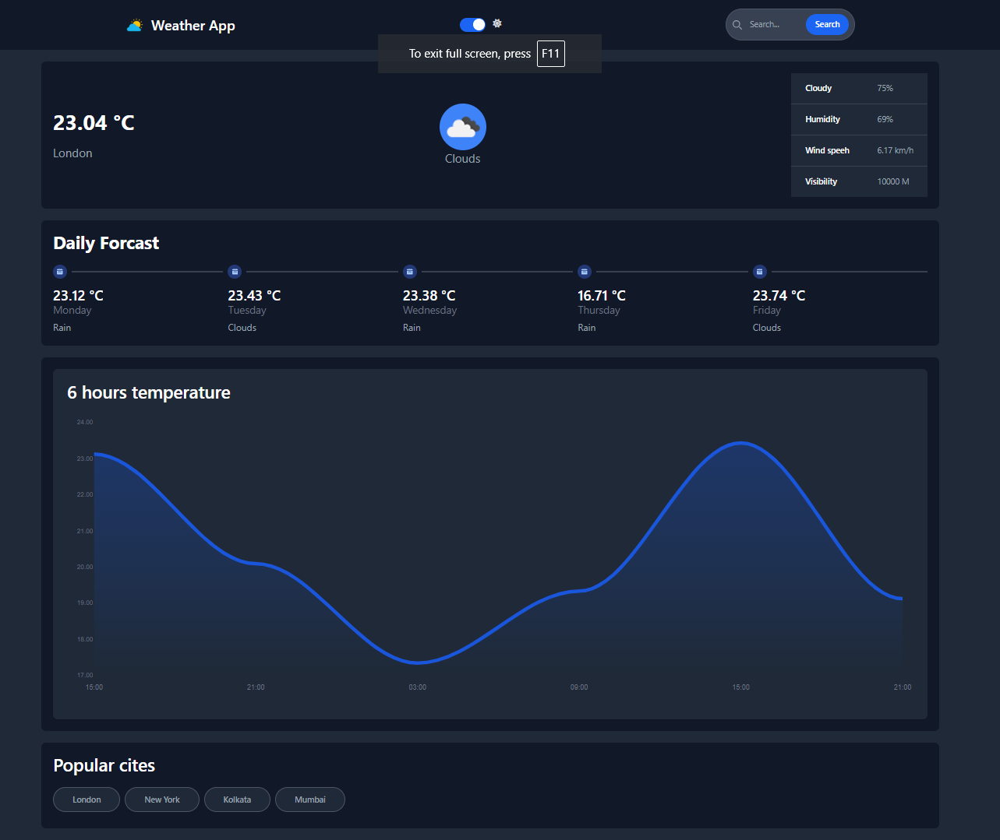
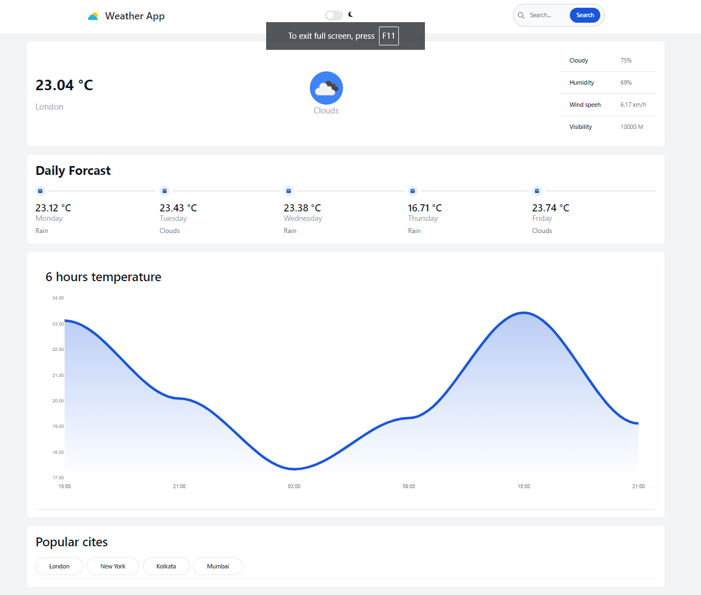

# Weather App

This is a simple and responsive Weather App built using HTML, JavaScript, and the Tailwind CSS framework. The app fetches weather data from the OpenWeatherMap API and displays it in a clean and user-friendly interface. Components are taken from Flowbite, and charts are displayed using ApexCharts.

## Table of Contents
- [Features](#features)
- [Screenshot](#screenshot)
- [Technologies Used](#technologies-used)
- [Installation](#installation)
- [Usage](#usage)
- [API Reference](#api-reference)
- [Contributing](#contributing)

## Features
- Fetches current weather data for any city.
- Displays temperature, weather conditions, and other relevant data.
- Displays weather trends in charts.
- Responsive design for mobile and desktop views.
- Dark and light mode support.
- Clean and modern UI with components from Flowbite.

## Screenshot



## Technologies Used
- **HTML**: For structuring the app.
- **JavaScript**: For fetching and displaying weather data.
- **Tailwind CSS**: For styling the app.
- **Flowbite**: For pre-designed UI components.
- **ApexCharts**: For displaying weather data trends in charts.
- **OpenWeatherMap API**: For fetching weather data.

## Installation

1. Clone the repository:
    ```bash
    git clone https://github.com/Asimcoded/weather-app-using-tailwindcss
    cd weather-app
    ```

2. Open `index.html` in your browser to view the app.

## Usage

1. Enter the name of the city in the search box.
2. Click on the search button or press 'Enter'.
3. The app will display the current weather data for the entered city.
4. View the weather trends in the charts provided by ApexCharts.
5. Toggle between dark and light modes using the mode switcher.

## API Reference

The weather data is fetched from the [OpenWeatherMap API](https://openweathermap.org/api). You need an API key to use this service.

1. Sign up at OpenWeatherMap and get your API key.
2. Replace `YOUR_API_KEY` in the JavaScript file with your actual API key:
    ```javascript
    const apiKey = 'YOUR_API_KEY';
    ```

## Contributing

Contributions are welcome! Please fork the repository and create a pull request with your changes.

1. Fork the repository
2. Create your feature branch (`git checkout -b feature/AmazingFeature`)
3. Commit your changes (`git commit -m 'Add some AmazingFeature'`)
4. Push to the branch (`git push origin feature/AmazingFeature`)
5. Open a pull request

## Live Site

Check out the live version of the app at [Your Live Site Link](https://weather-app-asimdas.netlify.app/).

## Social Links

- [GitHub](https://github.com/Asimcoded)
- [X](https://x.com/asimdas0711)
- [LinkedIn](https://www.linkedin.com/in/dasasim/)